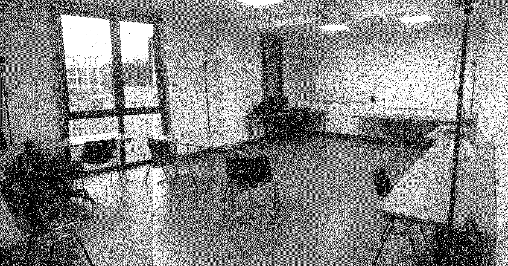
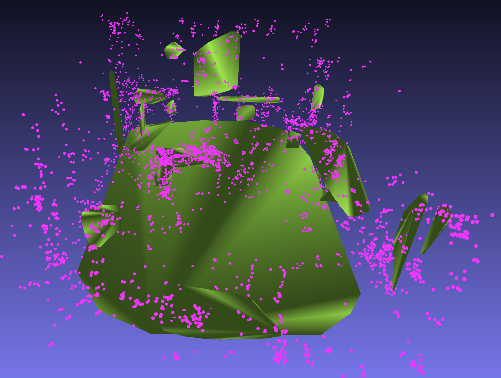
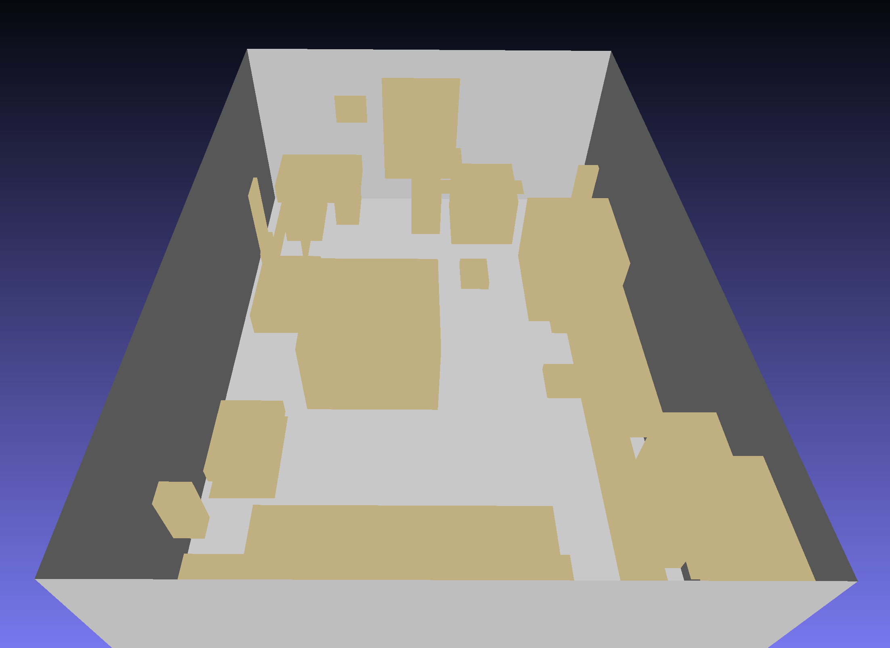

<b>Desc</b>

Squeeze as much info as possible from two-camera devices that expose the following SLAM byproducts: (1) sparse point cloud and (2) detected planes.

To do so, structures are detected by exploring different hyperparameters for (1) DBSCAN Clustering, and (2) 3D Line Detection and merged using ad-hoc strategies that consider the detected planes' bounding boxes.

<b>Results</b>

The following are (1) the real room, (2) the device's information, and (3) the result

<b>Usage</b>

There is much adapting and it's not very out-of-the-box, but it basically uses 

-  `raw_data/real_planes/*.obj`, the planes detected by the device

- `raw_data/original_pcd.ply`, the (very sparse) point cloud provided by the device

And secondarily

- `raw_data/*.txt` files indicating the arbitrary linear transformation that the device's capturing instance randomly chose to axis-align and center data, which are easily computed from the previous information but are not included in this repo.

<b>Requirements</b>

- Python3's package open3d

- C++ building of our slight variation of <a href='https://github.com/xiaohulugo/3DLineDetection'>3DLineDetector</a>, which itself uses OpenMP & OpenCV > 2.4.x. 
